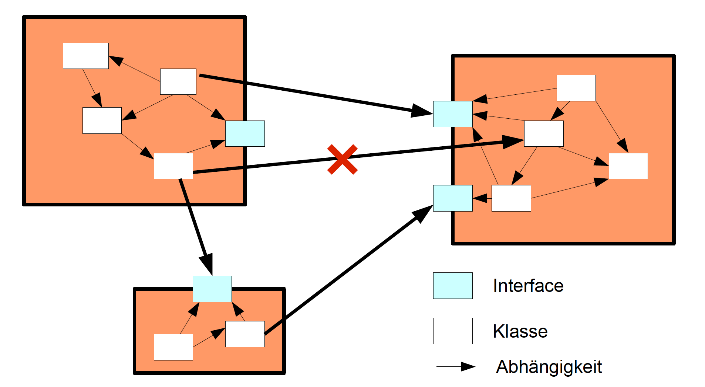
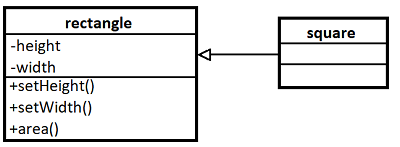
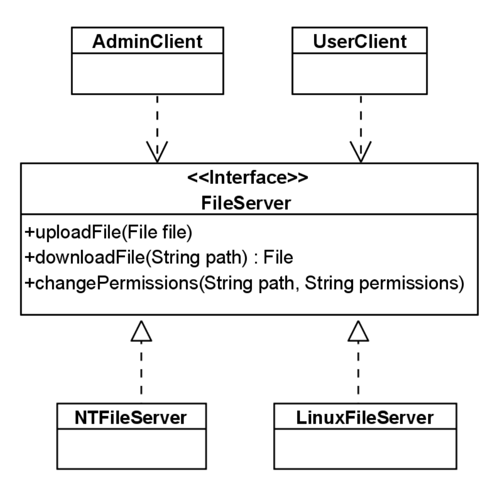
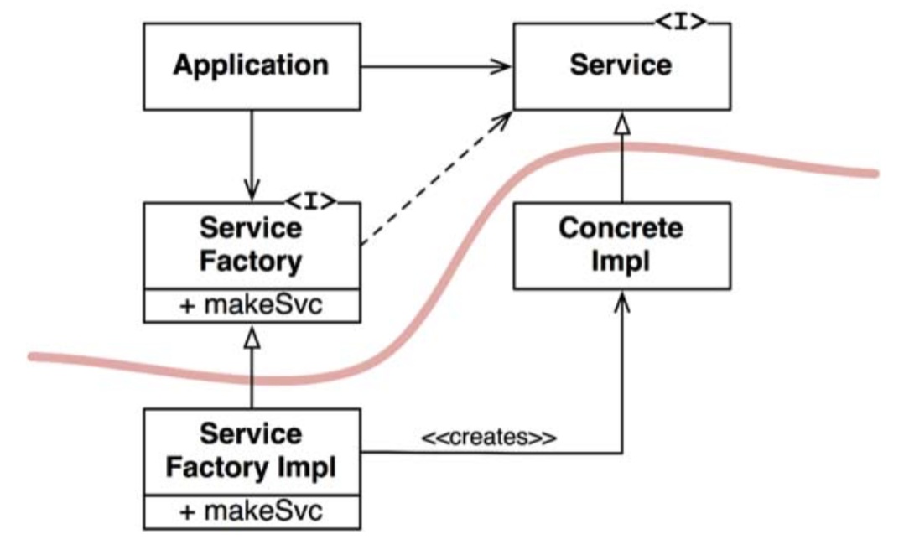
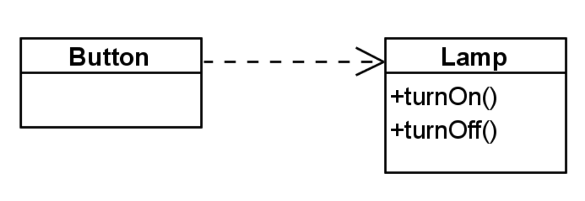

name: inverse
layout: true
class: center, middle, inverse
---
# Software Architecture
## Design Principles

.footnote[<a href="mailto:christian.ribeaud@fhnw.ch">Christian Ribeaud</a>]
---
template: inverse
# SOLID Principles
---
layout: false
# Why Principles?
- Gives advice on how to approach the design.
- Helps to avoid typical mistakes.
- Principles generates guidelines for action.
- Guidelines for quality assessment. Metrics are derived from principles to make quality measurable.
- Principles are knowledge based on experience:
  - Abstracted from many years of experience.
  - Adopted, confirmed and promulgated by others.
???
Good software systems begin with clean code. On the one hand, if the bricks aren't well made, the architecture of the building doesn't matter much. On the other hand, you can make a substantial mess with well-made bricks. This is where the SOLID principles come in.
---
.left-column[
  ## SOLID
  ### S
]
.right-column[
## Single Responsability Principle
_A class should have one and only one reason to change, meaning that a class should have only one job or responsibility._

[Conway](https://en.wikipedia.org/wiki/Conway%27s_law)'s law: the best structure for a software system is heavily influenced by the social structure of the organization that uses it so that each software module has one, and only one, reason to change.
]
???
- https://reflectoring.io/single-responsibility-principle/
  - types of responsabilities: business logic, external integration, data, control flow, ...
  - consequences: understandability, learning curve, flexibility, reusability, testability, ...
- **Conway**: when you write a software module, you want to make sure that when changes are requested, those changes can only originate from a single person, or rather, a single tightly coupled group of people representing a single narrowly defined business function. You want to isolate your modules from the complexities of the organization as a whole, and design your systems such that each module is responsible (responds to) the needs of just that one business function (https://cloudnative.ly/the-single-responsibility-principle-srp-77895368c068).
- Uncle Bob's SRP is more about Conway's Law than [Curly](https://blog.codinghorror.com/curlys-law-do-one-thing/)'s Law. Uncle Bob advocates applying Curly's Law (do one thing) to functions not classes (https://softwareengineering.stackexchange.com/questions/395419/how-can-a-class-have-multiple-methods-without-breaking-the-single-responsibility/395459).
- In it, they took multiple examples of software created to solve the same purpose (for example word processing, financial management and database software), and compared the code bases created by loosely-coupled open source teams, and those created by tightly-coupled teams. Their study found that the often co-located, focused product teams created software that tended more towards tightly-coupled, monolithic codebases. Whereas the open source projects resulted in more modular, decomposed code bases (https://www.thoughtworks.com/insights/articles/demystifying-conways-law).
---
.left-column[
  ## SOLID
  ### S
]
.right-column[
### Minimize Coupling

- No coupling between classes that do not perform a common task.
- Coupling between modules or components only via interfaces


]
???
- `DefaultTreeSelectionModel`
- Niedrige/Starke Kopplung
---
.left-column[
  ## SOLID
  ### S
]
.right-column[
### Maximize Cohesion

- Tight coupling between classes that perform a common task.
- Classes which perform a common task belong together to the same package.
- Classes which are only weakly coupled belong to different packages (**Separation of Concerns** on _package_ level).

<video width="550" controls>
 <source src="cohesion_and_coupling.mp4" type="video/mp4">
Your browser does not support the video tag.
</video>
]
---
.left-column[
  ## SOLID
  ### S
]
.right-column[
### Exercise

1. Fork https://github.com/ribeaud/solid-kata to your account (so you will be able to adapt it as you want to your needs)
1. Clone the repository and open it in **IDEA**
1. Have a look at **srp** module, analyze and run test `AccountServiceShould`
1. Does this module follow the **SRP** principle?
1. How could we improve it? Once you've reached a satisfying result, create a branch (_srp_ as name) and push it.
]
???
- http://codekata.com/
- https://kata-log.rocks/banking-kata
- https://github.com/heykarimoff/solid.python
- https://github.com/joebew42/study-path
---
.left-column[
  ## SOLID
  ### S
  ### O
]
.right-column[
## OCP: The Open-Closed Principle
_Software entities (classes, modules, functions, components, etc.) should be closed for modification, but open for extension._

### Closed For modification
New features getting added to the software component, should NOT have to modify existing code or binary code.

### Open For extension
A software component should be extendable to add a new feature/behavior to it.
]
???
- Extension: Extending the _behavior_ of a module.
- Modification: Changing the _code_ of a module.
---
.left-column[
  ## SOLID
  ### S
  ### O
]
.right-column[
### Why Closed for Modifications?
Question: Why not simply change the code if I needed? Two perspectives:
* Module was **already delivered to customers**, a change will not be accepted. If you need to change something, hopefully you opened your module for extension!
* Module is a **third-party library only available as binary code**. If you need to change something, hopefully the third-party opened the module for extension!
]
???
- Workaround based on _extension_
---
.left-column[
  ## SOLID
  ### S
  ### O
]
.right-column[
### Possible implementations of this principle
- Create subclass and overwrite method.
- Reuse existing classes by delegation.

### Frameworks are examples for the application of this principle:
- To use frameworks, base (_abstract_) classes must be extended, _interfaces_ must be implemented.
- Frameworks are usually 3th-party software and as such not changeable (except with Open Source)
]
???
- https://docs.oracle.com/javase/7/docs/api/java/awt/LayoutManager.html
- https://www.baeldung.com/spring-data-jpa-method-in-all-repositories
---
.left-column[
  ## SOLID
  ### S
  ### O
]
.right-column[
### Rigid, Fragile, Immobile Designs
#### Rigid
**Rigid** designs are hard to change – every change causes many changes to other parts of the system.
#### Fragile
**Fragile** designs tend to break in many places when a single change is made.
#### Immobile
**Immobile** designs contain parts that could be useful in other systems, but the effort and risk involved with separating those parts from the original system are too big.
]
???
- https://sortega.github.io/development/2016/02/07/tradeoffs/ for a discussion on rigid vs. fragile based on statically/dynamically typed language.
---
.left-column[
  ## SOLID
  ### S
  ### O
]
.right-column[
### Takeaway
* Abstraction is the key to supporting **OCP**.
* No matter how _open_ a module is, there will always be some kind of change which requires modification.
* Strategic opening. In doubt, wait for changes to happen. No elaborate upfront design.
]
---
.left-column[
  ## SOLID
  ### S
  ### O
]
.right-column[
### Exercise
1. Have a look at **ocp** module, analyze and run test `EmployeeShould`
1. Does this module follow the **OCP** principle?
1. How could we improve it? Once you've reached a satisfying result, create a branch (_ocp_ as name) and push it.
]
???
#### Problems
* Adding a new type of employee is hard, many classes have to be changed, the design is rigid.
* Create a company of one manager and two engineers. In `Application.java`, `payAmount` to them.
* Our example design is fragile: Many switch/case (if/else) statements that are both hard to find and hard to decipher.
---
.left-column[
  ## SOLID
  ### S
  ### O
  ### L
]
.right-column[
## LSP: The Liskov Substitution Principle
In 1988, [Barbara Liskov](https://en.wikipedia.org/wiki/Barbara_Liskov) wrote the following as a way of defining subtypes:

_Objects should be replaceable with their subtypes without affecting the
correctness of the program._

### The Square/Rectangle Problem
The canonical example of violation of the **LSP** is the famed (or infamous, depending on your perspective) square/rectangle problem.


]
???
- http://stg-tud.github.io/sedc/Lecture/ws13-14/3.3-LSP.html#mode=document:
  ```
  Rectangle r = ...
  r.setW(5);
  r.setH(2);
  assert(r.area() == 10)
  ```
  A square does not comply with the behavior of a rectangle: changing the height/width of a square behaves differently from changing the height/width of a rectangle. Actually, it doesn't make sense to distinguish between the width and the height of a square.
- **Barbara Liskov**:
  - 80y, MIT professor
  - Turing Award winner because of the substitution principle
  - One of the first women to be granted a doctorate in computer science in the US
---
.left-column[
  ## SOLID
  ### S
  ### O
  ### L
]
.right-column[
<video width="550" controls>
 <source src="liskov.mp4" type="video/mp4">
Your browser does not support the video tag.
</video>
### Solution to first pattern
Break the hierarchy

### Solution to second pattern
"Tell, don't ask"
]
???
**LSP** Violations in **Java** platform classes:
- `Properties` inherits from `Hashtable` (see https://bugs.openjdk.java.net/browse/JDK-8157123)
- `Stack` inherits from `Vector`
---
.left-column[
  ## SOLID
  ### S
  ### O
  ### L
]
.right-column[
### Design-by-Contract
Two main aspects of **Design-by-Contract**:
- Contracts. Classes (resp. interfaces) explicitly specify properties:
  - that must be respected by subclasses (or implementations)
  - on which clients (aka callers) can rely.
- Contract enforcement. Tools to check (_statically_ or _dynamically_) the implementation of subclasses against contracts of superclasses.

#### Specifying Explicit Contracts
- Pre- and Post-conditions
  - Declared for every method of the class.
  - **Preconditions** MUST be true for the method to execute.
  - **Post-conditions** MUST be true after the execution of the method.
]
???
- What can we do to support **LSP**?
- **Comments as contracts**. Easy and always possible, but not machine checkable.
- Assertions, Unit-tests
---
.left-column[
  ## SOLID
  ### S
  ### O
  ### L
]
.right-column[
### A Possible Contract for `Rectangle.setWidth`
```java
public class Rectangle implements Shape {
  private int width;
  private int height;
  public void setWidth(int w) {
    this.width = w;
  }
  ...
}
```
- Precondition for _setWidth_: `w > 0`
- Post-condition for _setWidth_: `getWidth() = w` and `getHeight()` did not change.
]
???
Subclasses must conform to the contract of their base class (behavioral subtyping)!
---
.left-column[
  ## SOLID
  ### S
  ### O
  ### L
]
.right-column[
### Behavioral Subtyping
#### Rule for preconditions
- Preconditions may be replaced by equal or weaker ones. Setting for instance `w > 10` (_strengthening_ the condition)
makes client code failing on substitution.

#### Rule for post-conditions
- Post-conditions may be replaced equal or stronger ones. The check for old values will fail when using `Square`
in client code. And we cannot remove the post condition to check for the old values because it would _weaken_ the post-condition.
]
???
- [software_design_programming_techniques.pdf](software_design_programming_techniques.pdf)
---
.left-column[
  ## SOLID
  ### S
  ### O
  ### L
]
.right-column[
### Why is the LSP Important?
**LSP** violations are a design smell. We may have generalized a concept prematurely and created a superclass where none is needed. Future requirements for the concept might not fit the class hierarchy we have created.

### How to identify LSP violations?

Some good indicators to identify **LSP** violations are:

- Conditional logic (using the `instanceof` operator or `object.getClass().getName()` to identify the actual subclass) in client code
- Empty, do-nothing implementations of one or more methods in subclasses
- Throwing an `UnsupportedOperationException` or some other unexpected exception from a subclass method
]
???
- https://reflectoring.io/lsp-explained/
---
.left-column[
  ## SOLID
  ### S
  ### O
  ### L
]
.right-column[
### Exercise
1. Have a look at **lsp** module, analyze and run both tests `FillingStationShould` and `VehicleShould`
1. Does this module follow the **LSP** principle?
1. How could we improve it? Once you've reached a satisfying result, create a branch (_lsp_ as name) and push it.
]
???
- They should update their fork
- https://davidhalewood.com/liskov-substitution-principle/
- Derived class objects should complement, not substitute base class behaviour (https://maksimivanov.com/posts/liskov-substitution-principle/):
---
.left-column[
  ## SOLID
  ### S
  ### O
  ### L
  ### I
]
.right-column[
## ISP: The Interface Segregation Principle
_No client should be forced to depend on methods it does NOT use._

Two clients are implemented for the file server:
- `AdminClient`, which uses all methods.
- `UserClient`, which uses only the upload/download methods.



Do you see any problems?
]
???
- Fragile design: changes to `changePermissions` have consequences to `UserClient` (even though it does NOT use it).
- https://medium.com/@jcqvisser/solid-and-the-interface-segregation-principle-in-ruby-49d3b09004ae
- `AdminClient` has a dependency to `FileServer` and `NTFileServer` implements `FileServer`
- p. 126 of [software_design_programming_techniques.pdf](software_design_programming_techniques.pdf)
---
.left-column[
  ## SOLID
  ### S
  ### O
  ### L
  ### I
]
.right-column[
### Exercise
1. Have a look at **isp** module, analyze and run the tests.
1. Does this module follow the **ISP** principle?
1. How could we improve it? Once you've reached a satisfying result, create a branch (_isp_ as name) and push it.
]
???
- http://codebuild.blogspot.com/2010/09/oop-solid-rules-interface-segregation.html
---
.left-column[
  ## SOLID
  ### S
  ### O
  ### L
  ### I
  ### D
]
.right-column[
## DIP: The Dependency Inversion Principle
_This principle tells us that the most flexible systems are those in which source code dependencies refer only to abstractions, not to concretions._

<video width="550" controls>
 <source src="dip.mp4" type="video/mp4">
Your browser does not support the video tag.
</video>
]
???
- See p. 26 of **se8full.pdf**
---
.left-column[
  ## SOLID
  ### S
  ### O
  ### L
  ### I
  ### D
]
.right-column[
### High-level, low-level Modules
Good software designs are structured into modules.
- High-level modules contain the important policy decisions and business models of an application – The identity of the application.

        High-level policy:
        The abstraction that underlies the application;
        the truth that does not vary when details are changed;
        the system inside the system;
        the metaphor.
- Low-level modules contain detailed implementations of individual mechanisms needed to realize the policy.
]
???
- High-level policies and business processes is what we want to reuse.
- If high-level modules depend on the low-level modules changes to the lower level details will force high-level modules to change.
- It becomes harder to use them in other contexts.
- It is the high-level modules that should influence the low-level details
---
.left-column[
  ## SOLID
  ### S
  ### O
  ### L
  ### I
  ### D
]
.right-column[
```java
public class Windows98Machine {

    private final StandardKeyboard keyboard;
    private final Monitor monitor;

    public Windows98Machine() {
        monitor = new Monitor();
        keyboard = new StandardKeyboard();
    }
    ...
}
```
This code will work, and we'll be able to use the `StandardKeyboard` and `Monitor` freely within our `Windows98Computer` class. Problem solved? Not quite. By declaring the `StandardKeyboard` and `Monitor` with the new keyword, we've tightly coupled these 3 classes together.

Not only does this make our `Windows98Computer` hard to test, but we've also lost the ability to switch out our `StandardKeyboard` class with a different one should the need arise. And we're stuck with our Monitor class, too.

Solutions?
]
???
- Solution at https://www.baeldung.com/solid-principles
---
.left-column[
  ## SOLID
  ### S
  ### O
  ### L
  ### I
  ### D
]
.right-column[
### Factories


The curved line is an architectural boundary. It separates the abstract from the concrete. All source code dependencies cross that curved line pointing in the same direction, toward the abstract side.

Note that the flow of control crosses the curved line in the opposite direction of the source code dependencies. The source code dependencies are **inverted** against the flow of control.
]
???
- p. 90
- https://en.wikipedia.org/wiki/Dependency_inversion_principle
---
.left-column[
  ## SOLID
  ### S
  ### O
  ### L
  ### I
  ### D
]
.right-column[
### Inversion of Control

**IoC** means to create instances of dependencies first and latter instance of a class (optionally injecting them through constructor), instead of creating an instance of the class first and then the class instance creating instances of dependencies.

<video width="550" controls>
 <source src="inversion_of_control.mp4" type="video/mp4">
Your browser does not support the video tag.
</video>
]
???
- [Dependency Injection](https://en.wikipedia.org/wiki/Dependency_injection)
- Thus, **IoC** inverts the flow of control of the program. Instead of the callee controlling the flow of control (while creating dependencies), the caller controls the flow of control of the program.
---
.left-column[
  ## SOLID
  ### S
  ### O
  ### L
  ### I
  ### D
]
.right-column[
### Layers and Dependencies
_...all well-structured object-oriented architectures have clearly defined layers, with each layer providing some coherent set of services through a well-defined and controlled interface..._ — **Grady Booch**


#### Possible interpretation

The higher the module is positioned in a layered architecture, the more general the function it implements. The lower the module, the more detailed the function it implements.

What do you think about this interpretation?
]
???
- This interpretation clearly violates DIP. Higher-level modules depend on lower-level modules.
- This is actually a typical structure of a layered architecture realized with structured programming.
- p. 144 of [software_design_programming_techniques.pdf](software_design_programming_techniques.pdf)
---
.left-column[
  ## SOLID
  ### S
  ### O
  ### L
  ### I
  ### D
]
.right-column[
### Exercise
1. Have a look at **dip** module.
1. Draw the **UML** of this application
1. Write some tests for `FileQuoteList`
1. `FileQuoteList` is file based. However, you would like to have the possibility to fetch the quotes from a database as well.
How would you adapt the design to support both possibilities?
1. Have a look at `RandomQuoteService`. Write some tests for `RandomQuoteService`.
1. Could we improve the design of `RandomQuoteService`?
1. Create a full-blown **REST** application using **Spring** framework.
]
???
- https://examples.javacodegeeks.com/dependency-injection-java-example/
- https://www.freecodecamp.org/news/a-quick-intro-to-dependency-injection-what-it-is-and-when-to-use-it-7578c84fa88f/
---
## Abilities

- You can enumerate and explain the **SOLID** design principles of object orientation.
- You can use the **SOLID** principles as needed to design an object-oriented program, justify design decisions, or evaluate a third-party design.
- You can question unreflected application of the **SOLID** principles in individual cases and know the limits of these principles.

## Links

- [Quizz](quizz.md)
- [Cheatsheet](solid-cheatsheet.pdf)
---
.left-column[
  ## Exercises
  ### SRP
]
.right-column[

Consider the following design, depicted in UML.

- `GUI` package uses `Rectangle` to draw rectangle shapes in the screen.
- `Rectangle` uses `DrawingUtility` to implement draw.
- `GeometricApplication` is a package for geometrical computations which also uses `Rectangle (area())`.

What do you think about the design?
]
???
- `Rectangle` has multiple responsibilities!
  1. Geometrics of rectangles represented by the method `area()`
  1. Drawing of rectangles represented by the method `draw()`
- Rectangle has low cohesion!
  - Geometrics and drawing do not naturally belong together.
- What are undesired effects of change?
- What would be a **SRP**-compliant design (see p. 15 of [software_design_programming_techniques.pdf](software_design_programming_techniques.pdf))
---
.left-column[
  ## Exercises
  ### SRP
  ### OCP
]
.right-column[
Following code snippet violates the **OCP** principle:
```java
public void draw(Form form) {
  if (form.type == CIRCLE) {
    drawCircle(form);
  } else if (form.type == SQUARE) {
    drawSquare(form);
  }
}
```
The method `draw()` is to draw a geometrical shape. If the program is extended by a new shape (e.g. triangle), this method must be adapted.

How could we improve this design?
]
???
- Solution at p. 16 of **Michaja/se8full.pdf**
---
.left-column[
  ## Exercises
  ### SRP
  ### OCP
  ### LSP
]
.right-column[
Implement a small class hierarchy for immutable tuples in **Java**. A tuple is a sequence of elements of a fixed length. The base trait/fully abstract class `Tuple` should take one type parameter `A` that denotes the type of elements the tuple can contain. Every tuple of length `n` should expose the following methods:
- A `length` method returning the number of elements `n` in the tuple.
- A `get` method, returning the element at a given index (starting at 0). It throws an exception if the `index` is `< 0` or `≥ n`.
- A `contains` method that checks whether a given object is an element of the tuple.
- An `add` method that creates a new tuple of length n + 1 that contains the elements of the existing tuple with a given element appended.
- A `map` method that executes a function on each element of the tuple.

You should implement concrete subclasses Tuple0, Singleton, Pair and TupleN for tuples of length 0, 1, 2 or any number ≥ 0, respectively. Their constructors should take the corresponding number of elements. For TupleN, you are free to use varargs, an array or some collection.
]
???
- See http://stg-tud.github.io/sedc/Lecture/ws16-17/exercises/ex03/ex03.pdf
- Another example (simpler) based on `equals` method contract: http://stg-tud.github.io/sedc/Lecture/ws13-14/3.3-LSP.html
- Implement the 5 tuple classes and 5 methods in **Java**. Since **Java** has use site variance, you cannot use variance annotations. However, again, the **types of the methods should be as precise as possible**. They will be different (potentially less precise) from the **Scala** solution, though, but the add method should not contain imprecise types such as `Object`. Hint: you are free to make the `add` method static in order to achieve this.
---
.left-column[
  ## Exercises
  ### SRP
  ### OCP
  ### LSP
  ### ISP
]
.right-column[
Remember **ISP** example:


Come up with a better, **ISP** compliant solution!
]
???
- p. 128 of [software_design_programming_techniques.pdf](software_design_programming_techniques.pdf)
---
.left-column[
  ## Exercises
  ### SRP
  ### OCP
  ### LSP
  ### ISP
  ### DIP
]
.right-column[

Consider a design excerpt from the smart home scenario.

`Button`
- Is capable of _sensing_ whether it has been activated/deactivated by the user.
- Once a change is detected, it turns the `Lamp` on respectively off.

Do you see any problem with this design?
]
???
- We cannot reuse `Button` since it depends directly on `Lamp` (_`Button` depends on `Lamp`_). But there are plenty of other uses for Button.
- `Button` should not depend on the details represented by `Lamp`.
- These are symptoms of the real problem (Violation of **DIP**):
  - The high-level policy underlying this (mini) design is not independent of the low-level details.
