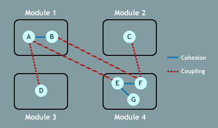
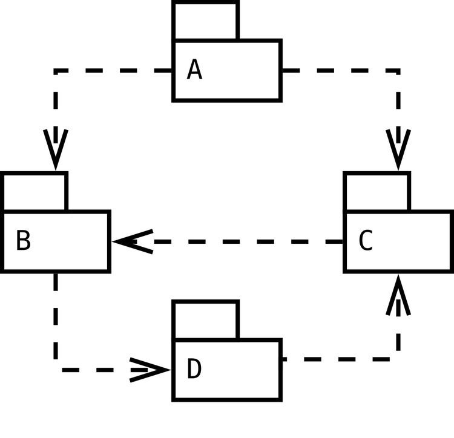
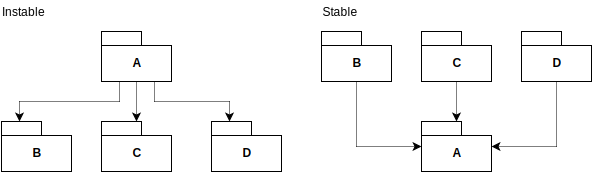

name: inverse
layout: true
class: center, middle, inverse
---
# Software Architecture
## Component Architecture

.footnote[<a href="mailto:christian.ribeaud@fhnw.ch">Christian Ribeaud</a>]
???
- https://clevercoder.net/2018/09/08/clean-architecture-summary-review/
---
layout: false
## Component principles

Components are the smallest entities that can be deployed as part of a system, for example **jar** or DLL files.

[Clean architecture](https://www.amazon.de/dp/0134494164/) suggests **six** principles to design components. The former **three** are about _component cohesion_, i.e. how to group classes together. The latter three are about _component coupling_, i.e. how to deal with relationships among components.

**Cohesion** is the indication of the relationship within a module. **Coupling** is the indication of the relationships between modules.

???
- https://medium.com/@nmuawiyah/coupling-cohesion-and-continuous-delivery-architecture-cd8532ddd1f2
- Good software design has high cohesion and low coupling
- An example of a low cohesive design in a **Java** programming language is within the `java.util` package which contains classes that offer functionality related to a scanner for reading text input, math functions (square root, sin, cosine, etc), random for generating a random number, collections and concurrency; this functions are not related. A counterexample is a `java.util.concurrent` package, which contains classes that cohesively offer concurrency
---
layout: false
.left-column[
  ## Cohesion
  ### REP
]
.right-column[
  ## The Reuse/Release Equivalence Principle

  _The granule of reuse is the granule of release_

  Classes and modules (i.e. a component) reused together should be released together. They should have the same version number and there should be proper documentation such as changelogs.
]
---
layout: false
.left-column[
  ## Cohesion
  ### REP
  ### CCP
]
.right-column[
  ## The Common Closure Principle

  _Gather into components those classes that change for the same reasons and at the same times. Separate into different components those classes that change at different times and for different reasons._

  Classes that change together should be grouped together, and vice versa. The [SRP](../3/#4) at component-level.
]
---
layout: false
.left-column[
  ## Cohesion
  ### REP
  ### CCP
  ### CRP
]
.right-column[
  ## The Common Reuse Principle

  _Don't force users of a component to depend on things they don't need._

  Don’t force users of a component to depend on things they don’t need. The [ISP](../3/#15) at component-level.

  A project will follow these principles to different extents, depending on its maturity. In the early stages, developability is more important so the focus should be more on the common closure principle. In the later stages, the focus will shift towards reusability and maintainability, and the reuse/release equivalence principles will gain more importance.
]
---
layout: false
.left-column[
  ## Coupling
  ### ADP
]
.right-column[
  ## The Acyclic Dependencies Principle

  No cycle in the dependency graph. Cycles couple components and, among other things, force them to be to released together. Use the [DIP](../3/#16) to break cycles.

  

  How to break the cycle?
]
???
- Package **A** depends on packages **B** and **C**. Package **B** in turn depends on package **D**, which depends on package **C**, which in turn depends on package **B**. The latter three dependencies create a cycle, which must be broken in order to adhere to the acyclic dependencies principle.
- Cyclic dependencies result in all sorts of nasty consequences: tight couplings, deadlocks, infinite recursions, ripple effects, bad maintainability, etc. The larger the cycle, the worse the consequences will get and the harder they are to understand and to break apart. So avoid them by using dependency inversion, publish-subscribe mechanisms or just by assigning responsibilities to modules hierarchically.
---
layout: false
.left-column[
  ## Coupling
  ### ADP
  ### SDP
]
.right-column[
  ## The Stable Dependencies Principle

  Less stable components should depend on more stable components. Depend in the direction of stability.

  

  Both of the diagrams are _stable_ or _instable_ with respect to package **A**.

  The diagram on the left demonstrates extreme instability. **A** depends on every other package, and is depended on by no packages. **A** is _dependent_. Any one of **A**'s dependencies could require **A** to change.

  The diagram on the right shows extreme stability. **A** depends on nothing, and everything else depends on it. Here, **A** is _independent_. Because **A** does not depend on anything, no other package could require it to change. On the flip side, because it is the dependee of three other packages, it has a good reason NOT to change.
]
???
So how does this play into the direction of stability?

Basically, this principle says that you should put stable packages in the position of stability and instable packages in the position of instability. If there is a package that is going to have many changes, then it should be depended on by as few packages as possible. If a there is a package that will not change, then it can be depended on by many packages.
---
layout: false
.left-column[
  ## Coupling
  ### ADP
  ### SDP
  ### SAP
]
.right-column[
  ## The Stable Abstractions Principle

  Stable components should be abstract, and vice versa. An example of an abstract stable component is a high-level policy which is changed by extension following the [OCP](../3/#7).

  This suggests that that there are four extremes that a package can fall into.

  1. Not abstract & Stable
  1. Abstract & Stable
  1. Not Abstract & Instable
  1. Abstract & Instable

]
???
Uncle Bob has a name for #1 and #4. He calls them the **Zone of Pain** and the **Zone of Uselessness** respectively. #1 means that a package is concrete, and depended on by many other packages. This is a package that would be very hard to change. #4 would be a package that is completely composed of abstractions, but no package is using those abstractions.

The sweet spot is somewhere between **Abstract & Stable** and **Not abstract & Instable**.
---
template: inverse
# Modular Programming
---
**Modular programming** is a software design technique that emphasizes separating the functionality of a program into independent, interchangeable modules, such that each contains everything necessary to execute only one aspect of the desired functionality.

in **Python** a _package_ is a collection of _modules_, while in **Java 9** a _module_ is a collection of _packages_ with enhanced access control.
---
.left-column[
  ## JPMS
]
.right-column[
According to [JSR 376](https://openjdk.java.net/projects/jigsaw/spec/), the key goals of modularizing the Java SE platform are:
- **Reliable configuration**. The module system checks whether a given combination of modules satisfies all dependencies before compiling or running code. This leads to fewer run-time errors.
- **Strong encapsulation**. Modules explicitly choose what to expose to other modules. Accidental dependencies on internal implementation details are prevented.
- **Scalable development**. Explicit boundaries enable teams to work in parallel while still creating maintainable codebases. Only explicitly exported public types are shared, creating boundaries that are automatically enforced by the module system.
- **Security**. Strong encapsulation is enforced at the deepest layers inside the JVM. This limits the attack surface of the Java runtime. Gaining reflective access to sensitive internal classes is not possible anymore.
- **Optimization**. Because the module system knows which modules belong together, including platform modules, no other code needs to be considered during **JVM** startup.
]
???
- https://www.oreilly.com/library/view/java-9-modularity/9781491954157/ch01.html
- https://blog.codefx.org/java/java-module-system-tutorial/
- `java --list-modules`
- `java --describe-module java.sql`
---
## Abilities

- You can explain basic differences between _classes_, _objects_ and _modules_.
- You can describe basic scenarios for using _modules_.
- You can apply and evaluate technical support for modular programming.
---
.left-column[
  ## Exercises
  ### modserv.cli
]
.right-column[
[modserv.cli](https://github.com/ribeaud/ch.fhnw.swa.modserv.cli)
]
---
.left-column[
  ## Exercises
  ### modserv.cli
  ### modserv
]
.right-column[
[modserv](https://github.com/ribeaud/ch.fhnw.swa.modserv)
]