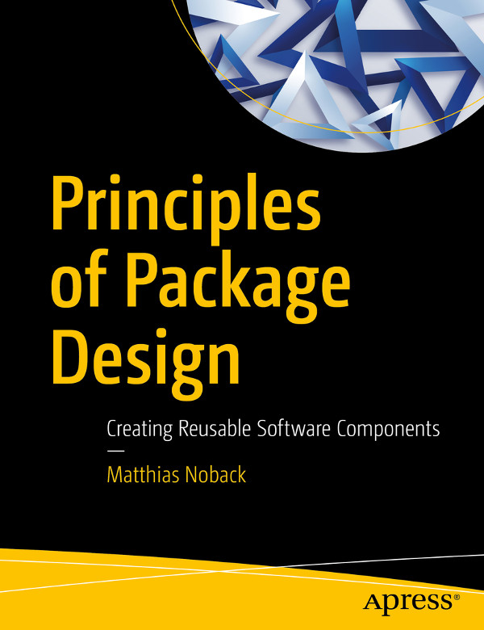
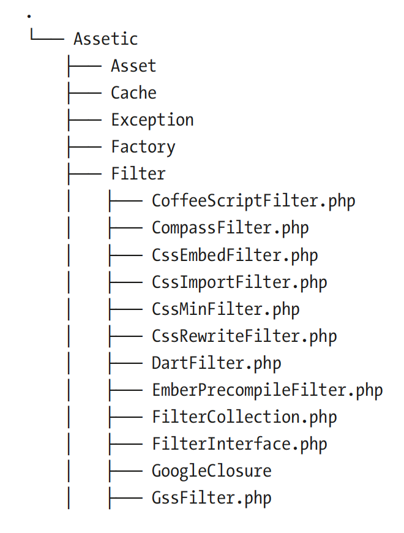
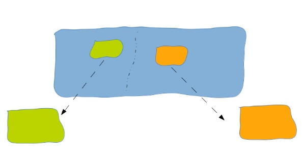
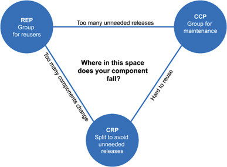
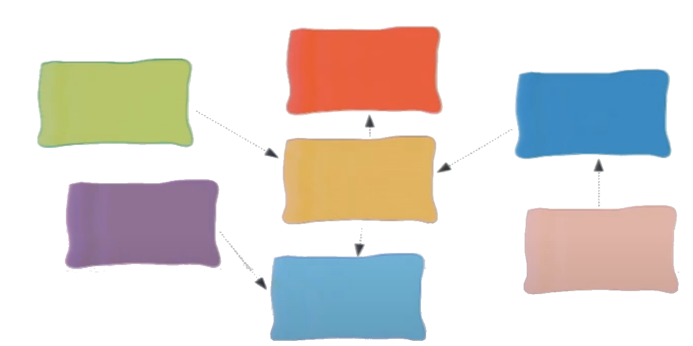
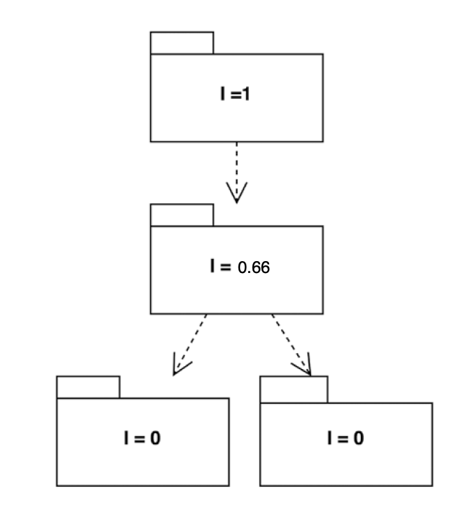
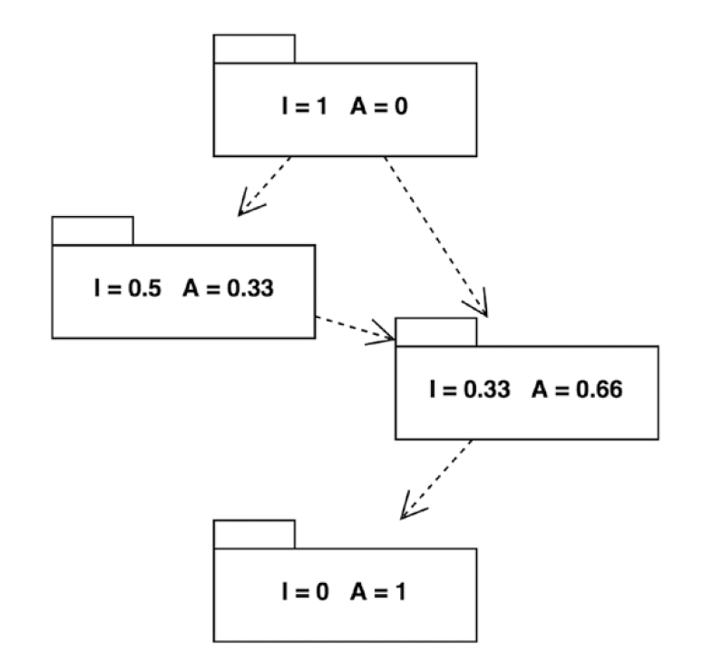
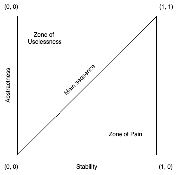

name: inverse
layout: true
class: center, middle, inverse
---
# Software Architecture
## Component Architecture

.footnote[<a href="mailto:christian.ribeaud@fhnw.ch">Christian Ribeaud</a>]
???
- https://clevercoder.net/2018/09/08/clean-architecture-summary-review/
---
layout: false
.left-column[
  ## Component Architecture
  ### Component Principles
]
.right-column[
Components could be considered as a _group_ of classes. This could be a **package**, a **module**, a **library** or just a **component**. A component could be deployable, for example as a **jar** file.

[Clean architecture](https://www.amazon.de/dp/0134494164/) suggests **six** principles to design components. The former **three** are about _component cohesion_, i.e. how to group classes together. The latter three are about _component coupling_, i.e. how to deal with relationships among components.

**Cohesion** is the indication of the relationship within a module. **Coupling** is the indication of the relationships between modules.


]
???
- https://medium.com/@nmuawiyah/coupling-cohesion-and-continuous-delivery-architecture-cd8532ddd1f2
- Good software design has **high cohesion** and **low coupling**
- An example of a low cohesive design in a **Java** programming language is within the `java.util` package which contains classes that offer functionality related to a scanner for reading text input, math functions (square root, sin, cosine, etc), random for generating a random number, collections and concurrency; this functions are not related. A counterexample is a `java.util.concurrent` package, which contains classes that cohesively offer concurrency
---
layout: false
.left-column[
  ## Component Architecture
  ### Component Principles
  ### Book
]
.right-column[

]
???
- **Matthias Noback** is a professional **PHP** developer
- https://www.youtube.com/watch?v=1iFs64sVP7Q
---
.left-column[
  ## Cohesion
  ### REP
]
.right-column[
  ## The Reuse/Release Equivalence Principle

  _The granule of reuse is the granule of release_

  Classes and modules (i.e. a component) reused together should be released together. They should have the same version number and there should be proper documentation such as changelogs.

  In order to make use of a package in other code, we need to be able to safely depend on that package.
]
???
- https://randycoulman.com/blog/2014/01/28/packaging-principles-part-1/
---
layout: false
.left-column[
  ## Cohesion
  ### REP
]
.right-column[
Things to do to make your component safely re-usable by others:
* Keep your package under version control
* Add a package definition file (`setup.py`, `pom.xml`, ...)
* Use [Semantic Versioning](https://semver.org/)
    * `Major.Minor.Patch`
* Design for backward compatibility
* Add metafiles:
    * `README` and documentation
    * [License](https://choosealicense.com/)
    * Change Log
    * Upgrade Notes
    * Guidelines for Contributing
* Quality control: Tests, CI, static analysis, ...
]
???
- https://gitlab.com/biomedit/sett
- https://www.jering.tech/articles/semantic-versioning-in-practice
---
layout: false
.left-column[
  ## Cohesion
  ### REP
]
.right-column[
### Exercises
* What is an **Open Source Copyleft License**? Understand the different types of licenses in the **Open Source** community.
* What can I assume if a publicly published project has no license?
* When you fix a bug and your code stays _backwards compatible_, which part of the license should you increase?
* When you implement changes and your code becomes _backwards incompatible_ (aka **breaking change**),
which part of the license should you increase?
* When you add functionality (aka **API change**) and your code stays _backwards compatible_,
which part of the license should you increase?
]
???
- http://opensource.guide/legal/
---
layout: false
.left-column[
  ## Cohesion
  ### REP
  ### CCP
]
.right-column[
  ## The Common Closure Principle

  _Gather into components those classes that change for the same reasons and at the same times. Separate into different components those classes that change at different times and for different reasons._

  Classes that change together should be grouped together, and vice versa. The **SRP** at component-level.
]
---
.left-column[
  ## Cohesion
  ### REP
  ### CCP
]
.right-column[
### Reasons for change
* The application's features change
* The business rules change
* The web framework's best practices change
* The persistence library's configuration changes
* ...
]
---
.left-column[
  ## Cohesion
  ### REP
  ### CCP
]
.right-column[
### Violation
[Assetic](https://github.com/kriswallsmith/assetic) is an asset management framework for **PHP**.


Notice that these classes are not all
closed against the same kinds of changes: if anything changes with regard
to the way the [Compass](http://compass-style.org/) compiler works, a change will be made in just one or two classes inside the package.
]
???
- https://packagist.org/packages/kriswallsmith/assetic
- Afterwards the package maintainer needs to release a new version of the entire package to make the
changes available to all its users. This will require people to upgrade their projects (and
probably also bring in many unrelated changes from the repository), which may or may
not have unwanted side-effects.
---
.left-column[
  ## Cohesion
  ### REP
  ### CCP
]
.right-column[
### Example
If you are building a package to determine the distance between two planets, its classes should be all related to that objective and not related to planet mass calculation.

Let’s say that some physicist discovers a new way to calculate the mass of a planet. If following this principle, you would have to make changes only to the package associated to this specific functionality and the distance calculator would not require any change.
]
???
- We can also see here that this principle is related to the **OCP** so we always need to be concerned on how to change our software behaviour by extending it, and not changing existent code.
---
.left-column[
  ## Cohesion
  ### REP
  ### CCP
  ### CRP
]
.right-column[
  ## The Common Reuse Principle

  _Don't force users of a component to depend on things they don't need. Classes that aren't reused together should not be grouped together._

  Don’t force users of a component to depend on things they don’t need. The **ISP** at component-level.

  
]
???
- Different perspective (for users, clients, ...) by comparison with **CCP** (for maintainers), it is all about splitting a package.
- A dependency upon a package is a dependency upon everything within the package.
- Changes to a class that I don't care about will still force a new release of the package, and still cause me to go through the effort of upgrading and revalidating.
- _Interface Segregation Principle_
---
.left-column[
  ## Cohesion
  ### REP
  ### CCP
  ### CRP
]
.right-column[
### Examples
* [Gaufrette](https://github.com/KnpLabs/Gaufrette), a **PHP** filesystem abstraction layer, or [flysystem](https://github.com/thephpleague/flysystem)
* [Guava](https://github.com/google/guava) vs. [Apache Commons](https://commons.apache.org/)
]
---
.left-column[
  ## Cohesion
  ### REP
  ### CCP
  ### CRP
]
.right-column[
### Conclusion
There are some good reasons for splitting packages. Those reasons have advantages for both users and maintainers. A package that adheres to the **CRP** has the following characteristics:
* It's coherent: All the classes it contains are about the same thing. Users don’t need to install a large package just to use one class or a small group of classes.
* It has no _optional_ dependencies: all its dependencies are true requirements; they are mentioned explicitly and have sensible version ranges. Users don’t need to manually add extra dependencies to their project.
* They use dependency inversion to make dependencies abstract instead of concrete.
* As an effect, they are open for extension and closed for modification. Adding or modifying an alternative implementation doesn't mean opening the package, but creating an extra package.
]
???
- `git subtree split` seems to help here (see http://blog.s-schoener.com/2019-04-20-git-subrepo/ as well)
---
.left-column[
  ## Cohesion
  ### REP
  ### CCP
  ### CRP
  ### Tension Diagram
]
.right-column[
You cannot satisfy all 3 principles at the same time:



The edges of the diagram describe the cost of abandoning the principle on the opposite vertex:
* Focus on **REP** and **CRP**: too many components are impacted when simple changes are made.
* Focus on **CCP** and **REP**: too many unneeded releases to be generated.

A project will follow these principles to different extents, depending on its maturity. In the early stages, developability is more important so the focus should be more on the **CCP**.

In the later stages, the focus will shift towards reusability and maintainability, and the **REP** will gain more importance.
]
???
- https://blog.codinghorror.com/rule-of-three/
---
# Component Coupling

---
.left-column[
  ## Coupling
  ### ADP
]
.right-column[
  ## The Acyclic Dependencies Principle

  _The dependency structure between packages must be a directed acyclic
graph; that is, there must be no cycles in the dependency structure._

  Cycles couple components and, among other things, force them to be to released together.

  
]
???
- Package **A** depends on packages **B** and **C**. Package **B** in turn depends on package **D**, which depends on package **C**, which in turn depends on package **B**. The latter three dependencies create a cycle, which must be broken in order to adhere to the acyclic dependencies principle.
---
.left-column[
  ## Coupling
  ### ADP
]
.right-column[
### Consequences
* **Tight coupling**. It makes reuse of an individual module difficult.
* **Infinite recursion**
* [Deadlock](https://en.wikipedia.org/wiki/Deadlock)
* **Ripple effect**. When making a small change to a software system, it can cause a ripple effect to other modules.
* **Bad maintainability**. Understanding the code is harder. Lack of understanding makes changes harder and more error-prone. Also, if components are in a circular dependency they are more difficult to test because they can not be tested separately.
]
---
.left-column[
  ## Coupling
  ### ADP
]
.right-column[
### Example
1. https://github.com/ribeaud/component-kata, module **adp**
1. Perform a _Cyclic Dependencies Analysis_ provided by **IDEA**
1. How could we break the cycle?
]
???
* `feature/adp`
* https://wiki.sei.cmu.edu/confluence/display/java/DCL60-J.+Avoid+cyclic+dependencies+between+packages: The tight coupling between the classes in the two packages can be weakened by introducing an interface called BankApplication in a third package, bank. The cyclic package dependency is eliminated by ensuring that the AccountHolder does not depend on User but instead relies on the interface by importing the bank package (and not by implementing the interface).
---
.left-column[
  ## Coupling
  ### ADP
]
.right-column[
### Breaking the Cycles
* **DIP**
* [Mediator](https://howtodoinjava.com/design-patterns/behavioral/mediator-pattern/)
* [Chain of responsibility](https://www.baeldung.com/chain-of-responsibility-pattern)
* Mediator and chain of responsibility combined: an event system
]
---
layout: false
.left-column[
  ## Coupling
  ### ADP
  ### SDP
]
.right-column[
  ## The Stable Dependencies Principle

  _Less stable components should depend on more stable components. Depend in the direction of stability._

  

  Both of the diagrams are _stable_ or _instable_ with respect to package **A**.

  The diagram on the left demonstrates extreme instability. **A** depends on every other package, and is depended on by no packages. **A** is _dependent_. Any one of **A**'s dependencies could require **A** to change.

  The diagram on the right shows extreme stability. **A** depends on nothing, and everything else depends on it. Here, **A** is _independent_. Because **A** does not depend on anything, no other package could require it to change. On the flip side, because it is the dependee of three other packages, it has a good reason NOT to change.
]
???
So how does this play into the direction of stability?

Basically, this principle says that you should put stable packages in the position of stability and instable packages in the position of instability. If there is a package that is going to have many changes, then it should be depended on by as few packages as possible. If a there is a package that will not change, then it can be depended on by many packages.
- _Instable_: has one because only _fan-out_ dependencies
- _Stable_: has zero because only _fan-in_ dependencies
---
layout: false
.left-column[
  ## Coupling
  ### ADP
  ### SDP
]
.right-column[
### Stability Metric

```math
I: Instability = (Fan-out) / (Fan-in + Fan-out)
```
This metric has the range `[0,1]`, `0` being maximally _stable_ and `1` maximally _instable_. A component with zero outgoing dependencies is maximally stable.

The **SDP** says that the stability metric should increase if you move from one component to its outgoing dependencies.
]
???
- _Fan-in_: Incoming dependencies. This metric identifies the number of classes outside this component that depend on classes within the component (_afferent coupling_).
- _Fan-out_: Outgoing dependencies. This metric identifies the number of classes inside this component that depend on classes outside the component (_efferent coupling_).
---
layout: false
.left-column[
  ## Coupling
  ### ADP
  ### SDP
]
.right-column[
### Example

]
---
layout: false
.left-column[
  ## Coupling
  ### ADP
  ### SDP
  ### SAP
]
.right-column[
  ## The Stable Abstractions Principle

  _A component should be as abstract as it is stable._

  Stable components should be abstract, and vice versa. An example of an abstract stable component is a high-level policy which is changed by extension following the **OCP**.
]
---
layout: false
.left-column[
  ## Coupling
  ### ADP
  ### SDP
  ### SAP
]
.right-column[
### Abstractness Metric
```math
Abstractness = (number of abstract classes and interfaces) /
(number of total classes and interfaces)
```
This metric range is `[0,1]`. `0` means _concrete_ and `1` means _fully abstract_.

The **SAP** says that a stable component should be _abstract_. In this way, we can keep it _stable_ and change it at the same time by extension.

On the other hand, an _unstable_ component can be concrete because changing it doesn't impact many components.
]
---
layout: false
.left-column[
  ## Coupling
  ### ADP
  ### SDP
  ### SAP
]
.right-column[
### Example


Strictly speaking, the values for **I** and **A** added together should be exactly `1`. This
would mean that all packages are as abstract as they are stable.
]
???
Now you only need to verify that each dependency arrow leads to a package
with a higher value for **A**. In other words, dependencies should have an increasing
abstractness.

This is completely unrealistic. There is always some margin to this. However, `I + A` should not be too far
away from **1**. In general, highly abstract packages should be highly stable, and concrete
packages should be unstable.
---
layout: false
.left-column[
  ## Coupling
  ### ADP
  ### SDP
  ### SAP
  ### Main Sequence
]
.right-column[
For any project, we can plot these two metrics in a scatter plot. The ideal situation is that most components fall in the **main sequence** zone in the following graph:



This suggests that that there are four extremes that a package can fall into.

1. Not abstract & Stable (0, 0)
1. Abstract & Stable (1, 0)
1. Not Abstract & Instable (0, 1)
1. Abstract & Instable (1, 1)
]
???
Uncle Bob has a name for #1 and #4. He calls them the **Zone of Pain** and the **Zone of Uselessness** respectively. #1 means that a package is concrete, and depended on by many other packages. This is a package that would be very hard to change. #4 would be a package that is completely composed of abstractions, but no package is using those abstractions.

The sweet spot is somewhere between **Abstract & Stable** and **Not abstract & Instable**.
---
## Links
- [Quizz on Cohesion](quizz_cohesion.md)
- [Quizz on Coupling](quizz_coupling.md)
- [Component Design - Cohesion](https://vimeo.com/469812551/8fef87e95f)
- [Component Design - Coupling](https://vimeo.com/471730578/90f2834d9d)
- [Static code analysis tools - SCAT](https://medium.com/@mari_azevedo/is-there-evaluation-and-quality-assurance-in-your-code-during-development-and-after-the-deploy-4a76e30e16b7)
???
- **Quizz on Cohesion** answers:
  1. b
  1. b
  1. a
  1. a
  1. a
  1. c
  1. b
  1. b
  1. c
  1. b
- **Quizz on Coupling** answers:
  1. c
  1. b
  1. c
  1. b
  1. b
  1. b
  1. a
  1. c
  1. a
  1. a
---
.left-column[
  ## Exercises  
]
.right-column[
1. https://github.com/ribeaud/component-kata, module **adp-spring**. If you try to run the test, you will get the following exception:
```
BeanCurrentlyInCreationException: Error creating bean
with name 'circularDependencyA': Requested bean is currently
in creation: Is there an unresolvable circular reference?
```
Suggestions?
1. Clone https://github.com/spring-projects/spring-petclinic and load the application into **IDEA**. Try to understand **DSM** (_Dependency Structure Matrix_) by following instructions given [here](https://blog.jetbrains.com/idea/2020/01/dsm-prepare-your-application-for-modularity/).
]
???
- https://www.baeldung.com/circular-dependencies-in-spring
