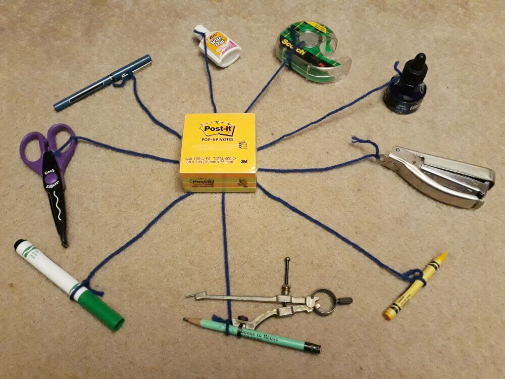

name: inverse
layout: true
class: center, middle, inverse
---
# Software Architecture
## Architecture Principles

.footnote[<a href="mailto:christian.ribeaud@fhnw.ch">Christian Ribeaud</a>]
???
- https://clevercoder.net/2018/09/08/clean-architecture-summary-review/
- https://pusher.com/tutorials/clean-architecture-introduction
---
template: inverse
# Clean Architecture
---
layout: false

In the image above, if you want to replace the scissors with a knife, what do you have to do?

You have to untie the strings that go to the pen, the ink bottle, the tape and the compass. Then you have to retie those items to a knife.

Maybe that works for the knife, but what if the pen and the tape say, "Wait, we needed scissors." So now the pen and the tape don't work and have to be changed, which in turn affects the objects tied to them.

It's a mess.
---

Now how do we replace the scissors? We only have to pull the scissors' string out from under the Post-it notes and add a new string that is tied to a knife. Way easier. The Post-it notes don't care because the string wasn't even tied to it.
???
The architecture represented by the second image was obviously easier to change. As long as the Post-it notes don't need to be changed often, this system will be very easy to maintain. This same concept is the architecture that will make your software easy to maintain and change.
---
.left-column[
## Clean Architecture
### Definition
]
.right-column[
The purpose of architecture is to facilitate the development, deployment, operation, and maintenance of a the system, leaving as many options open as possible, for as long as possible.

- Development
- Deployment
- Operation
- Maintenance
- Keeping Options Open
]
---
.left-column[
## Separating Layers
### Entities
]
.right-column[
Objects embodying a small set of Critical Business Rules.

Even if there were no application, these rules would still exist. For example, charging 10% interest on a loan is a rule that a bank might have. This would be true whether the interest was calculated on paper or using a computer.

**Entities** may be shared across apps in the same enterprise.
]
---
.left-column[
## Separating Layers
### Entities
### Use-cases
]
.right-column[
Not all Business Rules are as pure as **Entities**. The **Use Cases** are the **Business Rules** for a specific application.

]
---
.left-column[
## Separating Layers
### Entities
### Use-cases
### Interface adapters
]
.right-column[

]
---
.left-column[
## Separating Layers
### Entities
### Use-cases
### Frameworks and drivers
]
.right-column[
]
---
template: inverse
# Screaming Architecture
---
