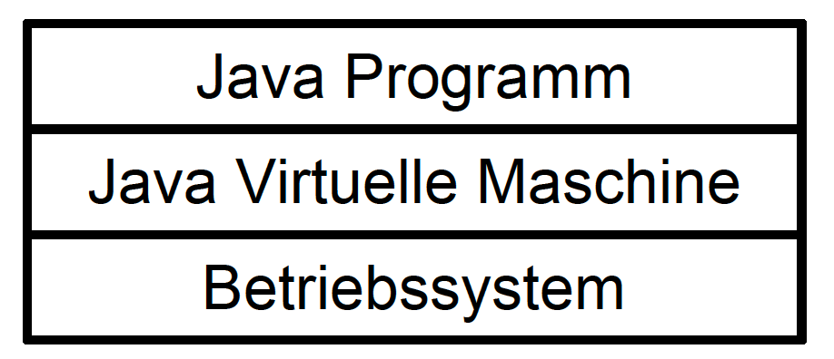

name: inverse
layout: true
class: center, middle, inverse
---
# Software Architecture
## Architecture Patterns

.footnote[<a href="mailto:christian.ribeaud@fhnw.ch">Christian Ribeaud</a>]
???
---
layout: false
## Architecture Patterns
- Layers
- Pipes and Filters
- Model-View-Controller
- Serverless
- Event-Driven
- Microservices
---
layout: false
.left-column[
  ## Layers
  ### Definition
]
.right-column[
The **Layers** architectural pattern helps to structure applications that can be decomposed into groups of subtasks in which each group of subtasks is at a particular level of abstraction.

]
---
layout: false
.left-column[
  ## Layers
  ### Definition
  ### Examples
]
.right-column[
## OSI Model
**OSI** (_Open Systems Interconnection_) is a reference model for how applications communicate over a network.
- 7 Layers
- Not used as-is. We prefer the TCP/IP model (similar concepts, slightly different layers).

]
???
- https://www.youtube.com/watch?v=LANW3m7UgWs
- https://medium.com/@tomanagle/the-osi-model-explained-in-simple-terms-2abc3c7adadc
- https://www.guru99.com/difference-tcp-ip-vs-osi-model.html
---
layout: false
.left-column[
  ## Layers
  ### Definition
  ### Examples
]
.right-column[
  ## Java Application

]
---
layout: false
.left-column[
  ## Layers
  ### Definition
  ### Examples
  ### Rules
]
.right-column[
Here are the rules:
1. Each layer is independent of the layers above.
1. Each layer is a service for the layer above.
1. The access to the layer below is done via an interface.
1. **Strict layering**: A layer may only access the layer immediately below it.
1. **Layer bridging**: A layer may access all lower layers.

]
---
layout: false
.left-column[
  ## Pipes and Filters
  ### Definition
  ### Examples
]
.right-column[
]
