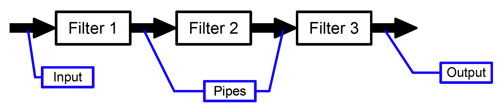
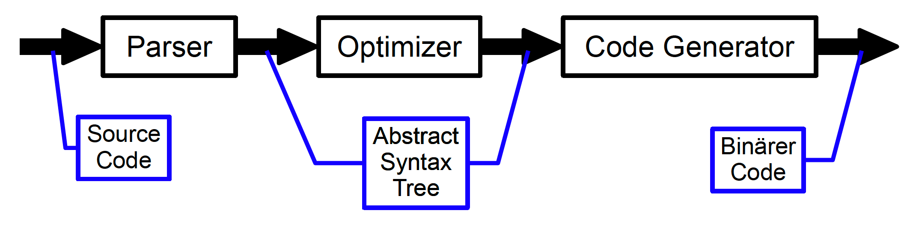
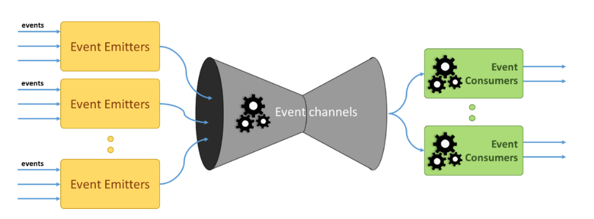
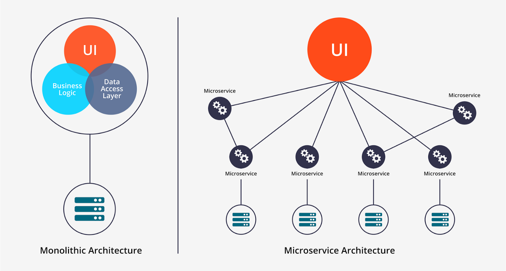
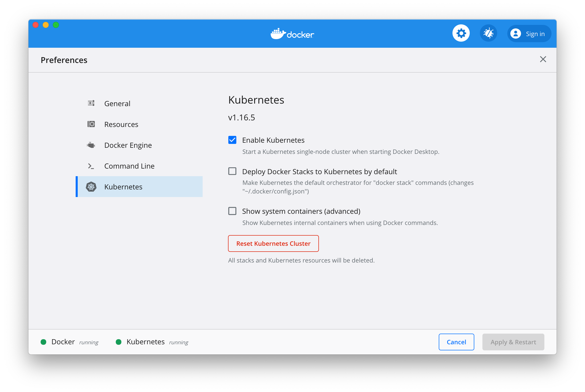

name: inverse
layout: true
class: center, middle, inverse
---
# Software Architecture
## Architecture Patterns

.footnote[<a href="mailto:christian.ribeaud@fhnw.ch">Christian Ribeaud</a>]
???
---
template: inverse
# Layers
---
layout: false
.left-column[
  ## Layers
  ### Definition
]
.right-column[
The **Layers** architectural pattern helps to structure applications that can be decomposed into groups of subtasks in which each group of subtasks is at a particular level of abstraction.


]
---
layout: false
.left-column[
  ## Layers
  ### Definition
  ### Examples
]
.right-column[
## OSI Model
**OSI** (_Open Systems Interconnection_) is a reference model for how applications communicate over a network:
- 7 Layers
- Not used as-is. We prefer the TCP/IP model (similar concepts, slightly different layers).


]
???
- https://www.youtube.com/watch?v=LANW3m7UgWs
- https://medium.com/@tomanagle/the-osi-model-explained-in-simple-terms-2abc3c7adadc
- https://www.guru99.com/difference-tcp-ip-vs-osi-model.html
---
layout: false
.left-column[
  ## Layers
  ### Definition
  ### Examples
]
.right-column[
  ## Java Application


]
---
layout: false
.left-column[
  ## Layers
  ### Definition
  ### Examples
  ### Multitier
]
.right-column[
Components within the layered architecture pattern are organized into horizontal layers, each layer performing a specific role within the application (e.g., _presentation logic_ or _business logic_).

Although the layered architecture pattern does not specify the number and types of layers that must exist in the pattern, most layered architectures consist of four standard layers: _presentation_, _business_, _persistence_, and _database_.


]
???
- https://en.wikipedia.org/wiki/Multitier_architecture
- https://www.oreilly.com/library/view/software-architecture-patterns/9781491971437/ch01.html: In some cases, the business layer and persistence layer are combined into a single business layer, particularly when the persistence logic (e.g., **SQL** or **HSQL**) is embedded within the business layer components. Thus, smaller applications may have only three layers, whereas larger and more complex business applications may contain five or more layers.
---
layout: false
.left-column[
  ## Layers
  ### Definition
  ### Examples
  ### Multitier
  ### Three-tier
]
.right-column[

]
---
template: inverse
# Pipes and Filters
---
layout: false
.left-column[
  ## Pipes and Filters
  ### Definition
]
.right-column[
Decompose a task that performs complex processing into a series of separate elements that can be reused.

This can improve performance (parallelization), scalability, testing, and reusability by allowing task elements that perform the processing to be deployed and scaled independently.


]
???
- https://medium.com/@syedhasan010/pipe-and-filter-architecture-bd7babdb908
- [AWS Step Functions](https://aws.amazon.com/step-functions/)
- Multithreading, queues, ...
---
layout: false
.left-column[
  ## Pipes and Filters
  ### Definition
  ### Examples
]
.right-column[
## Compiler



## Unix
Concatenation of simple programs (filters) via the textual input and output using the pipe symbol `|`. Example: list all **Java** source code files of a directory according to the number of lines of code.
```bash
wc *.java | sort -n | awk '/.+java/ {print $1 "\t" $4}'
```
]
???
- [Camel](https://camel.apache.org/)
---
layout: false
.left-column[
  ## Pipes and Filters
  ### Definition
  ### Examples
  ### Characteristics
]
.right-column[
- Each filter is a black box (users of the system don't need to know the logic behind the working of each filter) with a defined interface for data transmission and format.
- Filters can be combined and exchanged as required (loose coupling), assuming the interfaces and data formats fit together.
- Simple filters are easier to combine.
- Filters can data filter, enrich or convert.
- Filters can process the data in one go or in batches (streaming).
- Pull principle: filters actively fetch the data from the pipe.
- Push principle: pipe actively pushes the data into the filter.
- Pipes can work synchronously or asynchronously. In the latter case, they are often queues.
]
???
- https://medium.com/@syedhasan010/pipe-and-filter-architecture-bd7babdb908
- Disadvantages?
  - Addition of a large number of independent filters may reduce performance due to excessive computational overheads.
  - Not a good choice for an interactive system.
  - Pipe-and-filter systems may not be appropriate for long-running computations.
---
template: inverse
# Model-View-Controller
---
layout: false
.left-column[
  ## MVC
  ### Definition
]
.right-column[
**MVC** divides an interactive application into _three_ components.

The **Model** contains the core functionality and data. **Views** display information to the
user. Controllers handle user input. **Views** and **Controllers** together comprise the user interface.

A change-propagation mechanism ensures consistency between the user interface and the model.


]
???

---
layout: false
.left-column[
  ## MVC
  ### Definition
  ### Model
]
.right-column[
## Model
Data and business logic.
- **Model** is independent of **Controller** and **View**
- Defines interface for:
  - Read data
  - Manipulate data and
  - Initiate data processing (synchronous or asynchronous)
  - Data changed listener registration/deregistration
]
---
layout: false
.left-column[
  ## MVC
  ### Definition
  ### Model
  ### View
]
.right-column[
## View
Presentation of the data (or a part of it) as a graphic and/or as text.
- Data output
- Depending on the **Model**:
  - Registers itself as a data changed listener to the **Model**
  - Reads data from the **Model**
- Specific to a certain **Model**
]
---
layout: false
.left-column[
  ## MVC
  ### Definition
  ### Model
  ### View
  ### Controller
]
.right-column[
## Controller
Control of **Model** and **View** by user interactions.
  - Data input
  - Depending on the **Model**: data manipulation and processing
  - Influences state of the view
  - Often strong coupling between **View** and **Controller**
]
---
layout: false
.left-column[
  ## MVC
  ### Definition
  ### Model
  ### View
  ### Controller
  ### Class diagram
]
.right-column[


## Example

**Java Swing** Library, z.B. `JTree`:
- Model(s): `TreeModel`, `SelectionModel`
- View(s): `TreeCellRenderer`, `TreeCellEditor`
- Controller: `TreeUI`
]
???

- Traditionally used for desktop graphical user interfaces (GUIs), this pattern has become popular for designing web applications.
- Derivations:
  - [MVP](https://en.wikipedia.org/wiki/Model%E2%80%93view%E2%80%93presenter)
  - [MVVM](https://en.wikipedia.org/wiki/Model%E2%80%93view%E2%80%93viewmodel)
- https://blog.gisspan.com/2017/02/Redux-Vs-MVC,-Why-and-How.html
---
template: inverse
# Serverless
---
layout: false
.left-column[
  ## Serverless
  ### Definition
]
.right-column[
Serverless architectures are application designs that incorporate third-party _Backend as a Service_ (**BaaS**) services, and/or that include custom code run in managed, ephemeral containers on a _Functions as a Service_ (**FaaS**) platform.
]
???
- [AWS Lambda](https://aws.amazon.com/lambda/)
- https://martinfowler.com/articles/serverless.html
---
layout: false
.left-column[
  ## Serverless
  ### Definition
  ### Examples
]
.right-column[
## From:

## To:

]
???
In the original version, all flow, control, and security was managed by the central server application. In the **Serverless** version there is no central arbiter of these concerns. Instead we see a preference for **choreography over orchestration**, with each component playing a more architecturally aware role—an idea also common in a microservices approach.
---
layout: false
.left-column[
  ## Serverless
  ### Definition
  ### Examples
  ### Characteristics
]
.right-column[
## Advantages
- Reduced operational cost.
- No server management is necessary.
- Horizontal scaling completely automatic, elastic, and managed by the provider.
- No artifact to create or push beyond the source code itself.
- Stateless functions.
- No need to have an always up and running server.

## Disadvantages
- Not suitable for long-running computation.
- Could be challenging as each function is completely independent.
- Vendor control and lock-in
- No in-server state (so where is the state?)
- Startup latency
- Testing
]
???
- https://stackoverflow.com/questions/11707879/difference-between-scaling-horizontally-and-vertically-for-databases
- DDS p. 81
- https://12factor.net/processes
---
template: inverse
# Event-Driven
---
layout: false
.left-column[
  ## Event-Driven
  ### Definition
]
.right-column[
This architecture depends on **Event Producers** (or **Emitters**) and **Event Consumers**. The main idea is to decouple your system’s parts and each part will be triggered when an interesting event from another part has got triggered.



Just remember the **Event Producer** does not know which **Event Consumer** listening to which event. Also, other consumers do not know which of them listens to which events. Therefore, the main idea is _decoupling_ the parts of the system.
]
???
- https://codeburst.io/software-architecture-the-difference-between-architecture-and-design-7936abdd5830
- https://pradeeploganathan.com/architecture/event-driven-architecture/
- https://docs.microsoft.com/en-us/azure/architecture/guide/architecture-styles/event-driven
---
layout: false
.left-column[
  ## Event-Driven
  ### Definition
  ### Examples
]
.right-column[
## Examples
- Multiple subsystems must process the same events.
- Real-time processing with minimum time lag.
- High volume and high velocity of data, such as IoT.
]
???
- https://kafka.apache.org/ (https://www.youtube.com/watch?v=06iRM1Ghr1k)
---
layout: false
.left-column[
  ## Event-Driven
  ### Definition
  ### Examples
  ### Characteristics
]
.right-column[
## Benefits
- Producers and consumers are decoupled.
- No point-to-point integrations. It's easy to add new consumers to the system.
- Consumers can respond to events immediately as they arrive.
- Highly scalable and distributed.
- Subsystems have independent views of the event stream.
- Fine-grained communication: publishers keep publishing individual fine-grained events instead of waiting for a single aggregated event.
- Asynchronous communication: the publisher does not wait for the receiver to process an event before sending the next one.
- Real-time transmission.

## Challenges
- _There are only two hard problems in distributed systems: 2. Exactly-once delivery 1. Guaranteed order of messages 2. Exactly-once delivery_
]
???
Each consumer type typically runs in multiple instances, for resiliency and scalability. This can create a challenge if the events must be processed in order (within a consumer type), or if the processing logic is not idempotent.
---
template: inverse
# Microservices
---
layout: false
.left-column[
  ## Microservices
  ### Definition
]
.right-column[
Microservices architecture has become the most popular architecture in the last few years.

It depends on developing small, independent modular services where each service solves a specific problem or performs a unique task and these modules communicate with each other through well-defined API to serve the business goal.


]
???
- [Architektur-Spicker3-Microservices.pdf](Architektur-Spicker3-Microservices.pdf)
- https://docs.microsoft.com/en-us/azure/architecture/guide/architecture-styles/microservices
- https://www.pluralsight.com/guides/solid-design-microservices
---
layout: false
.left-column[
  ## Microservices
  ### Definition
  ### Characteristics
]
.right-column[
## Benefits
- Agility
- Small, focused teams
- Small code base
- Mix of technologies
- Fault isolation
- Scalability
- Data isolation

## Challenges
- Complexity
- Development and testing
- Lack of governance
- Network congestion and latency
- Data integrity
- Management
- Versioning
- Skillset
]
???
- p. 239: **Uncle Bob** is more critical:
- Services could be strongly by the data they share (_Decoupling Fallacy_)
- Services cannot always be independently developed, deployed, and operated. To the extend that they are coupled by data or behavior, the development, deployment, and operation must be coordinated.
---
## Links
- [Pattern-Oriented Software Architecture](pattern_oriented_software_architecture.pdf)
---
## Abilities
- You can name, describe and recognize important architectural patterns.
- You can explain the meaning of layer architectures, distinguish between strict and non-strict layer architectures, check existing layer architectures for correctness and design their own.
- You can explain variants of the **MVC** pattern including **MVVM**, investigate existing architectures for application of these patterns and design architectures based on these patterns.
---
.left-column[
  ## Exercises
  ### MVC
]
.right-column[
## MVC
1. Checkout project [ch.fhnw.swa.mvc.adder](https://github.com/ribeaud/ch.fhnw.swa.mvc.adder).
]
???
- Take Orig > 09 Architekturmuster
---
.left-column[
  ## Exercises
  ### MVC
  ### Serverless
]
.right-column[
## Serverless

1. Make sure that you enabled **Kubernetes** on your **Docker** installation (run `kubectl cluster-info`).

1. Follow instructions given [here](https://kubeless.io/docs/quick-start/) to install and test **Kubeless**.
]
???
- https://github.com/kubeless/kubeless
- https://github.com/brendandburns/designing-distributed-systems
- Explain **Lambda** on [AWS](https://aws.amazon.com/lambda/)